

    

<H2>
TECNOLÓGICO NACIONAL DE MÉXICO
</H2>

<H2>
INSTITUTO TECNOLÓGICO DE TIJUANA
</H2>

<H2>
SUBDIRECCIÓN ACADÉMICA
</H2>

<H2>
DEPARTAMENTO DE SISTEMAS Y COMPUTACIÓN
</H2>

<H2>
NOMBRE DE LOS ALUMNOS: 
</H2>

<H2>
RAYMUNDO HIRALES LAZARENO (N. CONTROL: 17212339)
</H2>

<H2>
PAULA ANDREA RAMOS VERDIN (N. CONTROL: 18210721)
</H2>

<H2>
Carrera: Ingeniería Informática
</H2>

<H2>
MATERIA: Datos Masivos
</H2>

<H2>
PROFESOR: JOSE CHRISTIAN ROMERO HERNANDEZ
</H2>

<H2>
Practica Evaluatoria U1
</H2>

<H2>
FECHA: 22/03/22
</H2>

 
 
 
 
 
 
 
 

### Introducción
En el presente documento se expondrá a detalle la práctica evaluatoria de la unidad 1, donde veremos la utilización de Scala y Spark en dataframes con el agregado de un archivo .csv

### Desarrollo
//RAYMUNDO HIRALES LAZARENO - 17212339
//PAULA ANDREA RAMOS VERDIN - 18210721
//Exam Unit 1 - 22/03/22

//1.- Comienza con una simple sesion de spark
import org.apache.spark.sql.SparkSession
val spark = SparkSession.builder().getOrCreate()

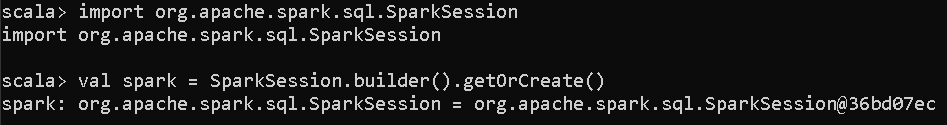

//2.- Cargue el Archivo Netflix Stock CSV, haga que Spark infiere los tipos de datos

val net = spark.read.option("header", "true").option ("inferSchema", "true") csv ("Netflix_2011_2016.csv")
net
net.printSchema()

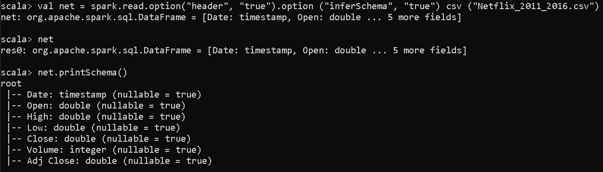

//3.- ¿Cuáles son los nombres de las columnas?
net.columns

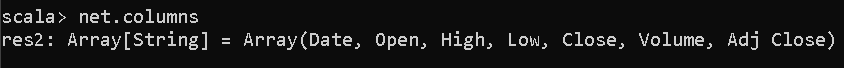

//4.- ¿Cómo es el esquema?
net.printSchema()

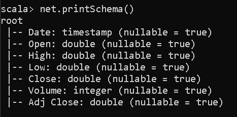

//5.- Imprime las primeras 5 columnas.
var col = 0
while(col < 5)
{
    println(net.columns(col))
    col = col + 1
}

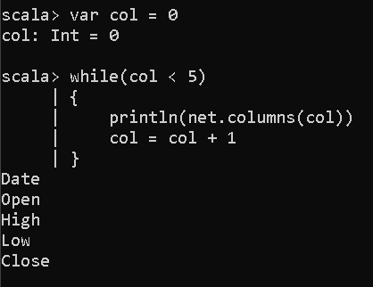

//6.-Usa describe () para aprender sobre el DataFrame.
net.describe().show()

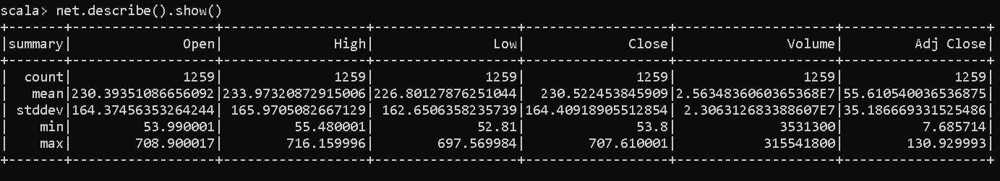

//7.- Crea un nuevo dataframe con una columna nueva llamada “HV Ratio” que es la relación que
//existe entre el precio de la columna “High” frente a la columna “Volumen” de acciones
//negociadas por un día. Hint - es una operación
import org.apache.spark.sql.Column
val nData = net.withColumn("HVRatio", net("High")/net("Volume"))
nData.show() 

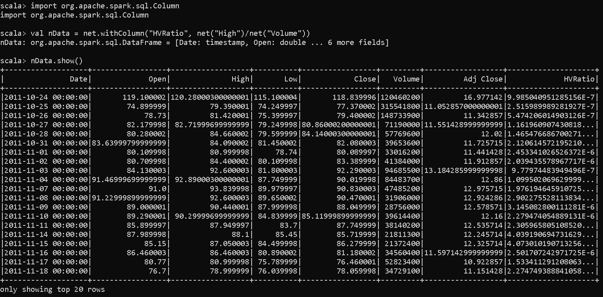

//8-.¿Qué día tuvo el pico mas alto en la columna “Open”?
val maxp = nData.orderBy(desc("Open"))
maxp.select("Date").limit(1).show()

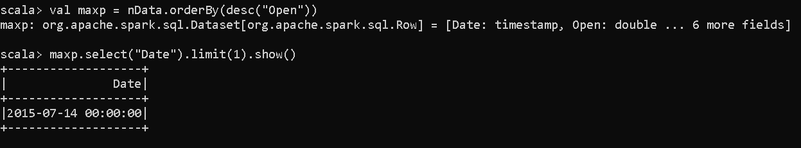

//9-.¿Cuál es el significado de la columna Cerrar “Close” en el contexto de información financiera, expliquelo no hay que codificar nada?
/*
Cuando el precio de la columna High sube parece ser lo mismo para la columna Close solo que esta 
siempre en menor cantidad que la High, lo que quiere decir que a medida que High
sube lo mas probables es que Close tambien lo haga pero en menor cantidad*/

//10-.¿Cuál es el máximo y mínimo de la columna “Volumen”?
nData.select(max("Volume")).show()
nData.select(min("Volume")).show()

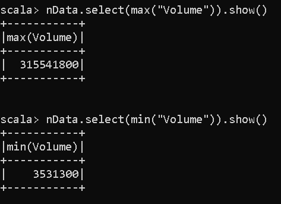

//11-.Con Sintaxis Scala/Spark $ conteste los siguiente:

//a-.Cuantos dias fue la columna "Close" inferior a $600?
nData.filter($"Close"<600).count()

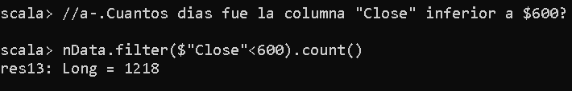

//b-.Que porcentaje del tiempo fue la columna "High" mayor que $500?
val tiempo:Double = nData.filter($"High">500).count()
val porcentaje:Double = (tiempo*100)/1259

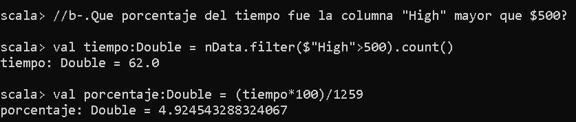

//c-.Cual es la correlacion de pearson entre columna "High" y la columna "Volumen"?
nData.select(corr("High","Volume").alias("Correlacion")).show()

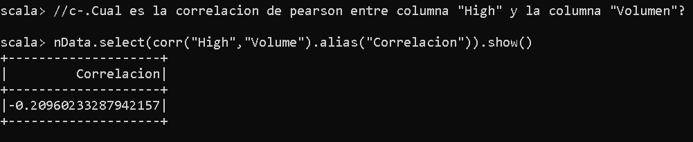

//d-.Cual es el maximo de la columna "High" por año?
nData.groupBy(year(nData("Date")).alias("Year")).max("High").sort(asc("Year")).show()

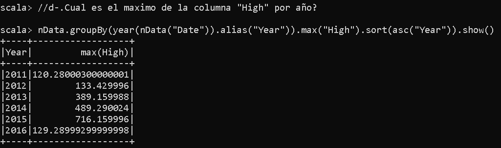

//e-.Cual es el promedio de la columna "Close" para cada mes del calendario?
nData.groupBy(month(nData("Date")).alias("Month")).avg("Close").sort(asc("Month")).show()

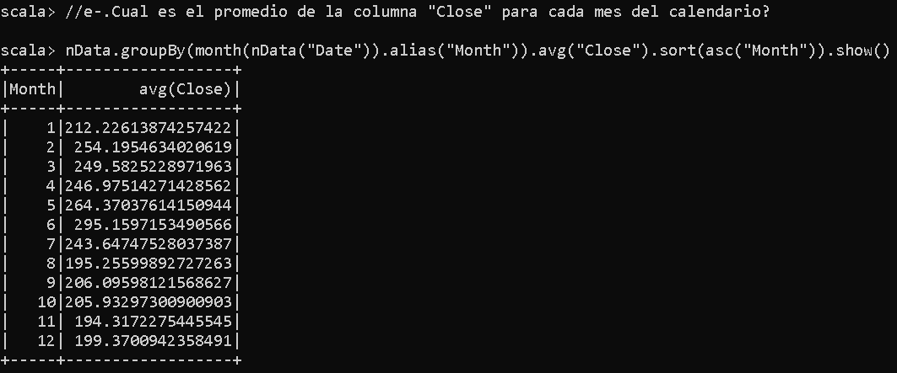

### Conclusión
Se puede decir que lo mas importante de esta practica es la familiarizacion de los comandos basicos de scala con dataframes podemos decir que a pesar de que a simple vista esta herramienta podría parecer de lo más complicado en realidad es una herramienta de lo más útil, resulto bastante satisfactorio y enriquecedor.

### link de youtube
https://youtu.be/BeJv1RX9HwA