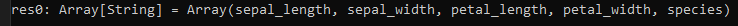
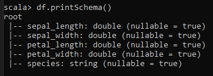
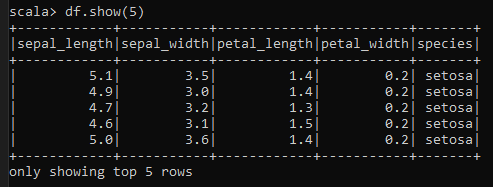
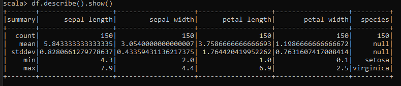
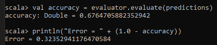

    

<H2>
TECNOLÓGICO NACIONAL DE MÉXICO
</H2>

<H2>
INSTITUTO TECNOLÓGICO DE TIJUANA
</H2>

<H2>
SUBDIRECCIÓN ACADÉMICA
</H2>

<H2>
DEPARTAMENTO DE SISTEMAS Y COMPUTACIÓN
</H2>

<H2>
NOMBRE DE LOS ALUMNOS: 
</H2>

<H2>
RAYMUNDO HIRALES LAZARENO (N. CONTROL: 17212339)
</H2>

<H2>
PAULA ANDREA RAMOS VERDIN (N. CONTROL: 18210721)
</H2>

<H2>
Carrera: Ingeniería Informática
</H2>

<H2>
MATERIA: Datos Masivos
</H2>

<H2>
PROFESOR: JOSE CHRISTIAN ROMERO HERNANDEZ
</H2>

<H2>
Practica Evaluatoria U2
</H2>

<H2>
FECHA: 23/05/22
</H2>

 
 
 
 
 
 
 
 

### Introducción
En el presente documento se expondrá a detalle la práctica evaluatoria de la unidad 2, donde veremos la utilización de un dataframe y el uso de scripts para su manejo.

### Desarrollo
//RAYMUNDO HIRALES LAZARENO - 17212339

//PAULA ANDREA RAMOS VERDIN - 18210721

//Exam Unit 2 - 22/03/22

import org.apache.spark.sql.types.DoubleType
import org.apache.spark.ml.classification.MultilayerPerceptronClassifier
import org.apache.spark.ml.evaluation.MulticlassClassificationEvaluator
import org.apache.spark.ml.feature.IndexToString
import org.apache.spark.ml.feature.StringIndexer
import org.apache.spark.ml.feature.VectorIndexer
import org.apache.spark.ml.feature.VectorAssembler
import org.apache.spark.ml.feature.IndexToString
import org.apache.spark.ml.Pipeline

//1-.Cargar el dataframe iris

val iris=spark.read.format("csv").option("header","true").load("iris.csv")

//Limpiar el dataframe

val df = iris.withColumn("sepal_length", $"sepal_length".cast(DoubleType)).withColumn("sepal_width", $"sepal_width".cast(DoubleType)).withColumn("petal_length", $"petal_length".cast(DoubleType)).withColumn("petal_width", $"petal_width".cast(DoubleType))

//2-.¿cual es el nombre de las columnas?

df.columns

//3-.¿Como es el esquema?

df.printSchema()

//4-.Imprimir las primeras 5 columnas

df.show(5)

//5-. Usa el metodo describe () para aprender mas sobre los datos del DataFrame

df.describe().show()

//6-.Haga la transformación pertinente para los datos categoricos los cuales serán nuestras etiquetas a clasificar.

val assembler = new VectorAssembler().setInputCols(Array("sepal_length", "sepal_width", "petal_length", "petal_width")).setOutputCol("features")

val features = assembler.transform(df)

val indexerL = new StringIndexer().setInputCol("species").setOutputCol("indexedLabel").fit(features)

val indexerF = new VectorIndexer().setInputCol("features").setOutputCol("indexedFeatures").setMaxCategories(4).fit(features)

val splits = features.randomSplit(Array(0.6, 0.4))

val training = splits(0)

val test = splits(1)

val layers = Array[Int](4, 5, 5, 3)

//7-.Construya el modelo de clasificación y explique su arquitectura.

val trainer = new MultilayerPerceptronClassifier().setLayers(layers).setLabelCol("indexedLabel").setFeaturesCol("indexedFeatures").setBlockSize(128).setSeed(System.currentTimeMillis).setMaxIter(200)

val converterL = new IndexToString().setInputCol("prediction").setOutputCol("predictedLabel").setLabels(indexerL.labels)

val pipeline = new Pipeline().setStages(Array(indexerL, indexerF, trainer, converterL))

val model = pipeline.fit(training)

//8-.Imprima los resultados del modelo

val predictions = model.transform(test)

val evaluator = new MulticlassClassificationEvaluator().setLabelCol("indexedLabel").setPredictionCol("prediction").setMetricName("accuracy")

val accuracy = evaluator.evaluate(predictions)
println("Error = " + (1.0 - accuracy))

### Conclusión
Se puede decir que lo mas importante de esta practica es el amplio uso que podemos darle a los scripts de scala para el manejo de dataframes a simple vista estos comandos pueden parecer de lo más complicado pero en realidad es una herramienta sencilla, intuitiva y practica, resulto bastante interesante y enriquecedor esta practica evaluatoria unidad 2.

### link de youtube
https://youtu.be/LV83nYQIfCk