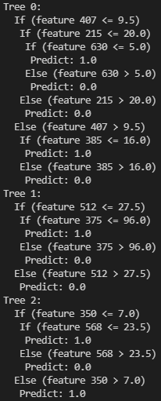
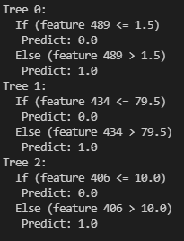

    

<H2>
TECNOLÓGICO NACIONAL DE MÉXICO
</H2>

<H2>
INSTITUTO TECNOLÓGICO DE TIJUANA
</H2>

<H2>
SUBDIRECCIÓN ACADÉMICA
</H2>

<H2>
DEPARTAMENTO DE SISTEMAS Y COMPUTACIÓN
</H2>

<H2>
NOMBRE DE LOS ALUMNOS: 
</H2>

<H2>
RAYMUNDO HIRALES LAZARENO (N. CONTROL: 17212339)
</H2>

<H2>
PAULA ANDREA RAMOS VERDIN (N. CONTROL: 18210721)
</H2>

<H2>
Carrera: Ingeniería Informática
</H2>

<H2>
MATERIA: Datos Masivos
</H2>

<H2>
PROFESOR: JOSE CHRISTIAN ROMERO HERNANDEZ
</H2>

<H2>
Practica 3
</H2>

<H2>
FECHA: 06/05/22
</H2>

 
 
 
 
 
 
 
 

//Ejemplo Clasificacion

import org.apache.spark.mllib.tree.RandomForest
import org.apache.spark.mllib.tree.model.RandomForestModel
import org.apache.spark.mllib.util.MLUtils

// Load and parse the data file.
val data = MLUtils.loadLibSVMFile(sc, "sample_libsvm_data.txt")
// Split the data into training and test sets (30% held out for testing)
val splits = data.randomSplit(Array(0.7, 0.3))
val (trainingData, testData) = (splits(0), splits(1))

// Train a RandomForest model.
// Empty categoricalFeaturesInfo indicates all features are continuous.
val numClasses = 2
val categoricalFeaturesInfo = Map[Int, Int]()
val numTrees = 3 // Use more in practice.
val featureSubsetStrategy = "auto" // Let the algorithm choose.
val impurity = "gini"
val maxDepth = 4
val maxBins = 32

val model = RandomForest.trainClassifier(trainingData, numClasses, categoricalFeaturesInfo,
  numTrees, featureSubsetStrategy, impurity, maxDepth, maxBins)

// Evaluate model on test instances and compute test error
val labelAndPreds = testData.map { point =>
  val prediction = model.predict(point.features)
  (point.label, prediction)
}
val testErr = labelAndPreds.filter(r => r._1 != r._2).count.toDouble / testData.count()
println(s"Test Error = $testErr")
println(s"Learned classification forest model:\n ${model.toDebugString}")

// Save and load model
model.save(sc, "target/tmp/myRandomForestClassificationModel")
val sameModel = RandomForestModel.load(sc, "target/tmp/myRandomForestClassificationModel")

//Ejemplo Regresion

import org.apache.spark.mllib.tree.RandomForest
import org.apache.spark.mllib.tree.model.RandomForestModel
import org.apache.spark.mllib.util.MLUtils

// Load and parse the data file.
val data = MLUtils.loadLibSVMFile(sc, "sample_libsvm_data.txt")
// Split the data into training and test sets (30% held out for testing)
val splits = data.randomSplit(Array(0.7, 0.3))
val (trainingData, testData) = (splits(0), splits(1))

// Train a RandomForest model.
// Empty categoricalFeaturesInfo indicates all features are continuous.
val numClasses = 2
val categoricalFeaturesInfo = Map[Int, Int]()
val numTrees = 3 // Use more in practice.
val featureSubsetStrategy = "auto" // Let the algorithm choose.
val impurity = "variance"
val maxDepth = 4
val maxBins = 32

val model = RandomForest.trainRegressor(trainingData, categoricalFeaturesInfo,
  numTrees, featureSubsetStrategy, impurity, maxDepth, maxBins)

// Evaluate model on test instances and compute test error
val labelsAndPredictions = testData.map { point =>
  val prediction = model.predict(point.features)
  (point.label, prediction)
}
val testMSE = labelsAndPredictions.map{ case(v, p) => math.pow((v - p), 2)}.mean()
println(s"Test Mean Squared Error = $testMSE")
println(s"Learned regression forest model:\n ${model.toDebugString}")

// Save and load model
model.save(sc, "target/tmp/myRandomForestRegressionModel")
val sameModel = RandomForestModel.load(sc, "target/tmp/myRandomForestRegressionModel")

