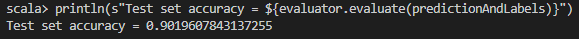

    

<H2>
TECNOLÓGICO NACIONAL DE MÉXICO
</H2>

<H2>
INSTITUTO TECNOLÓGICO DE TIJUANA
</H2>

<H2>
SUBDIRECCIÓN ACADÉMICA
</H2>

<H2>
DEPARTAMENTO DE SISTEMAS Y COMPUTACIÓN
</H2>

<H2>
NOMBRE DE LOS ALUMNOS: 
</H2>

<H2>
RAYMUNDO HIRALES LAZARENO (N. CONTROL: 17212339)
</H2>

<H2>
PAULA ANDREA RAMOS VERDIN (N. CONTROL: 18210721)
</H2>

<H2>
Carrera: Ingeniería Informática
</H2>

<H2>
MATERIA: Datos Masivos
</H2>

<H2>
PROFESOR: JOSE CHRISTIAN ROMERO HERNANDEZ
</H2>

<H2>
Practica 5
</H2>

<H2>
FECHA: 18/05/22
</H2>

 
 
 
 
 
 
 
 

//Ejemplo Multilayer perceptron classifier

import org.apache.spark.ml.classification.MultilayerPerceptronClassifier
import org.apache.spark.ml.evaluation.MulticlassClassificationEvaluator

// Load the data stored in LIBSVM format as a DataFrame. || Carga los datos almacenados en formato LIBSVM como DataFrame.

//val data = spark.read.format("libsvm").load("data/mllib/sample_multiclass_classification_data.txt")
val data = spark.read.format("libsvm").load("C:/Spark/spark-2.4.8-bin-hadoop2.7/data/mllib/sample_multiclass_classification_data.txt")

// Split the data into train and test || Divide los datos
val splits = data.randomSplit(Array(0.6, 0.4), seed = 1234L)
val train = splits(0)
val test = splits(1)

// specify layers for the neural network: || especificar capas para la red neuronal:
// input layer of size 4 (features), two intermediate of size 5 and 4 || capa de entrada de tamano 4 (features), dos intermedias de tamano 5 y 4
// and output of size 3 (classes) || y salida de tamano 3 (classes) 
val layers = Array[Int](4, 5, 4, 3)

// create the trainer and set its parameters || Crea el trainer y establece sus parametros.
val trainer = new MultilayerPerceptronClassifier()
  .setLayers(layers)
  .setBlockSize(128)
  .setSeed(1234L)
  .setMaxIter(100)

// train the model || entrena el model
val model = trainer.fit(train)

// compute accuracy on the test set || precision de calculo en el conjunto de prueba
val result = model.transform(test)
val predictionAndLabels = result.select("prediction", "label")
val evaluator = new MulticlassClassificationEvaluator()
  .setMetricName("accuracy")

println(s"Test set accuracy = ${evaluator.evaluate(predictionAndLabels)}")

//Resultado

