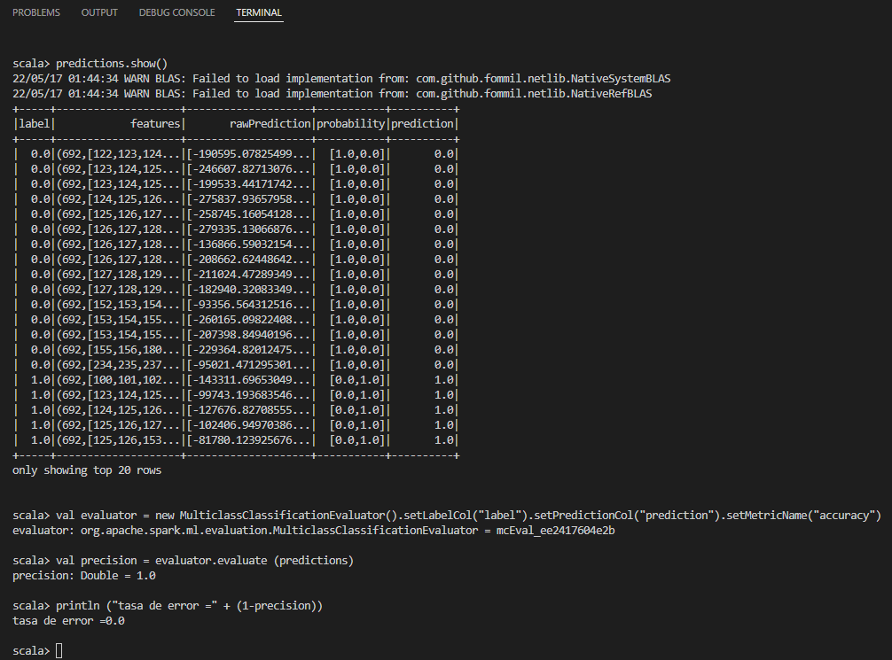

    

<H2>
TECNOLÓGICO NACIONAL DE MÉXICO
</H2>

<H2>
INSTITUTO TECNOLÓGICO DE TIJUANA
</H2>

<H2>
SUBDIRECCIÓN ACADÉMICA
</H2>

<H2>
DEPARTAMENTO DE SISTEMAS Y COMPUTACIÓN
</H2>

<H2>
NOMBRE DE LOS ALUMNOS: 
</H2>

<H2>
RAYMUNDO HIRALES LAZARENO (N. CONTROL: 17212339)
</H2>

<H2>
PAULA ANDREA RAMOS VERDIN (N. CONTROL: 18210721)
</H2>

<H2>
Carrera: Ingeniería Informática
</H2>

<H2>
MATERIA: Datos Masivos
</H2>

<H2>
PROFESOR: JOSE CHRISTIAN ROMERO HERNANDEZ
</H2>

<H2>
Practica 7
</H2>

<H2>
FECHA: 18/05/22
</H2>

 
 
 
 
 
 
 
 

//Importar las librerias necesarias

import org.apache.spark.ml.classification.NaiveBayes
import org.apache.spark.ml.evaluation.MulticlassClassificationEvaluator
import org.apache.spark.sql.SparkSession

//Cargar los datos especificando la ruta del archivo

val data = spark.read.format("libsvm").load("C:/spark/spark-2.4.8-bin-hadoop2.7/data/mllib/sample_libsvm_data.txt")

println ("Numero de lineas en el archivo de datos:" + data.count ())

//Mostrar las primeras 20 líneas por defecto

data.show()

//Divida aleatoriamente el conjunto de datos en conjunto de entrenamiento y conjunto de prueba de acuerdo con los pesos proporcionados. También puede especificar una seed

val Array (trainingData, testData) = data.randomSplit (Array (0.7, 0.3), 100L)
// El resultado es el tipo de la matriz, y la matriz almacena los datos de tipo DataSet

//Incorporar al conjunto de entrenamiento (operación de ajuste) para entrenar un modelo bayesiano
val naiveBayesModel = new NaiveBayes().fit(trainingData)

//El modelo llama a transform() para hacer predicciones y generar un nuevo DataFrame.

val predictions = naiveBayesModel.transform(testData)

//Salida de datos de resultados de predicción
predictions.show()

//Evaluación de la precisión del modelo

val evaluator = new MulticlassClassificationEvaluator().setLabelCol("label").setPredictionCol("prediction").setMetricName("accuracy")
// Precisión
val precision = evaluator.evaluate (predictions) 

//Imprimir la tasa de error
println ("tasa de error =" + (1-precision))

//Resultado

