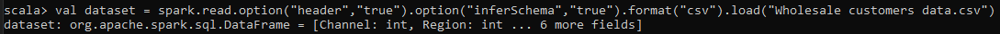
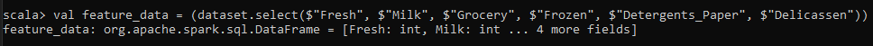
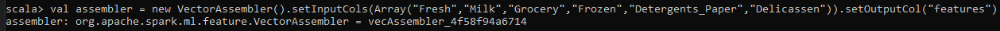
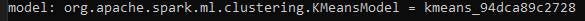
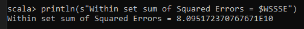
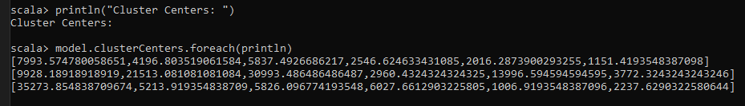

<p align="center">
    
</p>

<H2><p align="Center">TECNOLÓGICO NACIONAL DE MÉXICO</p></H2>

<H2><p align="Center">INSTITUTO TECNOLÓGICO DE TIJUANA</p></H2>

<H2><p align="Center">SUBDIRECCIÓN ACADÉMICA</p></H2>

<H2><p align="Center">DEPARTAMENTO DE SISTEMAS Y COMPUTACIÓN</p></H2>

<H2><p align="Center">NOMBRE DE LOS ALUMNOS: </p></H2>

<H2><p align="Center">RAYMUNDO HIRALES LAZARENO (N. CONTROL: 17212339)</p></H2>

<H2><p align="Center">PAULA ANDREA RAMOS VERDIN (N. CONTROL: 18210721)</p></H2>

<H2><p align="Center">Carrera: Ingeniería Informática</p></H2>

<H2><p align="Center">MATERIA: Datos Masivos</p></H2>

<H2><p align="Center">PROFESOR: JOSE CHRISTIAN ROMERO HERNANDEZ</p></H2>

<H2><p align="Center">Practica Evaluatoria U3</p></H2>

<H2><p align="Center">FECHA: 01/06/22</p></H2>

<br>
<br>
<br>
<br>
<br>
<br>
<br>
<br>


### Introduction 

Este proyecto es una forma de poder manipular el marco de datos, así los datos y poder obtener resultados y hacer comparaciones y poder hacer probabilidad en un futuro, podemos ver la información de manera ordenada tan importante para poder ver mejor los resultados y la manera fácil.

La primera parte es importar la biblioteca que necesita, en este caso es Soark Session para la sesión Spark como vemos antes, después de iniciar sesión para hacer más pequeños los errores e importar la biblioteca para kmeans para el modelo, lo último es cargar el conjunto de datos.

```scala
// 1-. Importar una simple sesión Spark.
import org.apache.spark.sql.SparkSession

// 2-. Utilice las lineas de código para minimizar errores
import org.apache.log4j.
Logger.getLogger("org").setLevel(Level.ERROR)

// 3-. Cree una instancia de la sesión Spark
val spark = SparkSession.builder().getOrCreate()

// 4-. Importar la librería de Kmeans para el algoritmo de agrupamiento.
import org.apache.spark.ml.clustering.KMeans

// 5-. Carga el dataset de Wholesale Customers Data
val dataset = spark.read.option("header","true").option("inferSchema","true").format("csv").load("Wholesale customers data.csv")
```
<p>

</p>

Para estas prácticas necesitamos seleccionar algunas columnas en específico

```scala
// 6-. Seleccione las siguientes columnas: Fresh, Milk, Grocery, Frozen, Detergents_Paper, Delicassen y llamar a este conjunto feature_data
val feature_data = (dataset.select($"Fresh", $"Milk", $"Grocery", $"Frozen", $"Detergents_Paper", $"Delicassen"))
```
<p>

</p>

Bueno, aquí solo importe la biblioteca para manipular vectores y ensamblar, y los usé

```scala
// 7-. Importar Vector Assembler y Vector
import org.apache.spark.ml.feature.VectorAssembler
import org.apache.spark.ml.linalg.Vectors

//8-.Crea un nuevo objeto Vector Assembler para las columnas de caracteristicas como un conjunto de entrada, recordando que no hay etiquetas
val assembler = new VectorAssembler().setInputCols(Array("Fresh","Milk","Grocery","Frozen","Detergents_Paper","Delicassen")).setOutputCol("features")
```
<p>

</p>

Con el objeto create vamos a transform, usamos transform y save en las caracteristicas, lo otro se usa el modelo kmeans

```scala
//9-.Utilice el objeto assembler para transformar feature_data
val  features = assembler.transform(feature_data)

//10-.Crear un modelo Kmeans con K=3
val kmeans = new KMeans().setK(3).setSeed(1L) 
val model = kmeans.fit(features)
```

<p>

</p>

Aquí solo falta evaluar el modelo e imprimir los resultados

```scala
//11-.Evalúe los grupos utilizando Within Set Sum of Squared Errors WSSSE e imprima los centroides.
val WSSSE = model.computeCost(features)
println(s"Within set sum of Squared Errors = $WSSSE")
```
<p>

</p>

Y lo último es solo imprimir los centros

```scala
println("Cluster Centers: ") 
model.clusterCenters.foreach(println)
```
<p>

</p>


### Conclusion

Después de crear el modelo y trabajar con los datos, es claro las cosas que a simple vista no podemos ver toda la información más clara con las cosas que realmente le importan, y hacer comparaciones con los otros resultados.

Cuando haces este tipo de análisis puedes aprender más sobre los datos, puedes ver la información, porque son diferentes los datos y el resultado, y si hiciste este modelo es más fácil leer la información importante.