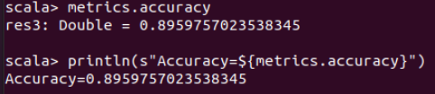
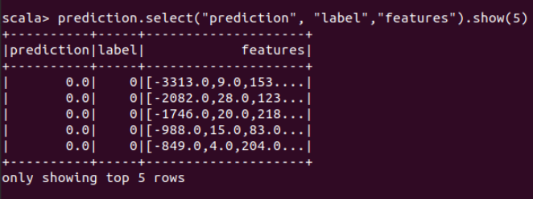
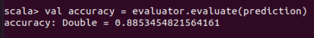

<p align="center">
    
</p>

<H2><p align="Center">TECNOLÓGICO NACIONAL DE MÉXICO</p></H2>

<H2><p align="Center">INSTITUTO TECNOLÓGICO DE TIJUANA</p></H2>

<H2><p align="Center">SUBDIRECCIÓN ACADÉMICA</p></H2>

<H2><p align="Center">DEPARTAMENTO DE SISTEMAS Y COMPUTACIÓN</p></H2>

<H2><p align="Center">NOMBRE DE LOS ALUMNOS: </p></H2>

<H2><p align="Center">RAYMUNDO HIRALES LAZARENO (N. CONTROL: 17212339)</p></H2>

<H2><p align="Center">PAULA ANDREA RAMOS VERDIN (N. CONTROL: 18210721)</p></H2>

<H2><p align="Center">Carrera: Ingeniería Informática</p></H2>

<H2><p align="Center">MATERIA: Datos Masivos</p></H2>

<H2><p align="Center">PROFESOR: JOSE CHRISTIAN ROMERO HERNANDEZ</p></H2>

<H2><p align="Center">Practica Evaluatoria U4</p></H2>

<H2><p align="Center">FECHA: 08/06/22</p></H2>

<br>
<br>
<br>
<br>
<br>
<br>
<br>
<br>


### Introduccion

Esta práctica es para ver el mejor modelo para este ejemplo, el conjunto de datos es bank.csv es un conjunto de datos relacionados con campañas de marketing directo (llamadas telefónicas) de una institución bancaria portuguesa. El objetivo de la clasificación es predecir si el cliente suscribirá un depósito a plazo (variable y) y tratamos de hacer una predicción con los modelos: SVM, árbol de decisión, regresión logística y perceptrón multicapa que son modelos de aprendizaje automático pero supervisados ​​es decir es una subcategoría del aprendizaje automático y la inteligencia artificial. Se define por su uso de conjuntos de datos etiquetados para entrenar algoritmos que clasifican datos o predicen resultados con precisión. A medida que los datos de entrada se introducen en el modelo, este ajusta sus pesos hasta que el modelo se haya ajustado correctamente, lo que ocurre como parte del proceso de validación cruzada. El aprendizaje supervisado ayuda a las organizaciones a resolver una variedad de problemas del mundo real a escala, como clasificar el correo no deseado en una carpeta separada de su bandeja de entrada.

En estos casos usamos este tipo de modelos para crear una comparación entre estos y obtener información valiosa sobre cuál es el mejor, en estos casos en específico nos basamos en la precisión y el error, y tratamos de explicar más sobre estos modelos también.
<br>

**Marco Teorico**
<br>
- SVM
- Decision Three
- Logistic Regresion
- Multilayer perceptron

Comencemos a hablar sobre cada uno de los modelos, ya que SVM es un algoritmo de aprendizaje automático supervisado que se puede usar para desafíos de clasificación o regresión. Sin embargo, se utiliza principalmente en problemas de clasificación. En el algoritmo SVM, trazamos cada elemento de datos como un punto en un espacio n-dimensional (donde n es una cantidad de características que tiene) y el valor de cada característica es el valor de una coordenada particular. Luego, realizamos la clasificación encontrando el hiperplano que diferencia muy bien las dos clases, ahora pasemos a la Decisión tres, que es un método de aprendizaje supervisado no paramétrico que se utiliza para la clasificación y la regresión. El objetivo es crear un modelo que prediga el valor de una variable de destino mediante el aprendizaje de reglas de decisión simples deducidas de las características de los datos. Un árbol puede verse como una aproximación constante por partes, los árboles de decisión aprenden de los datos para aproximarse a una curva sinusoidal con un conjunto de reglas de decisión if-then-else. Cuanto más profundo es el árbol, más complejas son las reglas de decisión y más ajustado es el modelo, mientras que la regresión logística es un algoritmo de clasificación de aprendizaje supervisado que se utiliza para predecir la probabilidad de una variable objetivo. La naturaleza de la variable objetivo o dependiente es dicotómica, lo que significa que solo habría dos clases posibles, por lo que la variable dependiente es de naturaleza binaria y tiene datos codificados como 1 (significa éxito/sí) o 0 (significa falla/no) y La percepción multicapa es una red neuronal donde el mapeo entre entradas y salidas no es lineal, tiene capas de entrada y salida y una o más capas ocultas con muchas neuronas apiladas juntas. Y mientras que en el Perceptrón la neurona debe tener una función de activación que imponga un umbral, como ReLU o sigmoides, las neuronas en un Perceptrón multicapa pueden usar cualquier función de activación arbitraria.

### Implementacion
<br>
¿Por qué usamos Scala y Spark como entorno de trabajo?

Bueno, Scala es un lenguaje funcional, por lo que la computación se puede distribuir entre los núcleos de un servidor multinúcleo y entre los servidores de un centro de datos. Esto hace que Scala sea especialmente una excelente opción para CPU multinúcleo y cargas de trabajo distribuidas de computación en la nube. Aprender Scala es indispensable para los escenarios de análisis de Big Data y Spark permite a los desarrolladores realizar operaciones en grandes volúmenes de datos en clústeres de forma rápida y con tolerancia a fallas. Cuando tenemos que manejar algoritmos, trabajar en memoria y no en disco mejora el rendimiento.

Así que decidimos usarlo porque es un entorno de trabajo muy liviano porque esta interfaz no usa muchas recursividades y esto no disminuye el potencial y el gran poder que tienen Scala y Spark y esto es fantástico si se trabaja con Big Data porque el conjunto de datos tan grande para hacer mas lentos los recurses y la PC en general, y no es tan dificil de analizar en este tipo de ambiente.


### Desarrollo

**Codigo comun**
<br>
Cada modelo necesita cierta biblioteca y está representado como aquí.

```scala
import org.apache.spark.sql.SparkSession
import org.apache.spark.ml.classification.LinearSVC
import org.apache.spark.mllib.evaluation.MulticlassMetrics
import org.apache.spark.ml.linalg.Vectors
import org.apache.spark.ml.feature.StringIndexer
import org.apache.spark.ml.feature.VectorIndexer
import org.apache.spark.ml.feature.VectorAssembler
import org.apache.spark.ml.Pipeline
```

Para arreglar cualquier pequeño error
```scala
import org.apache.log4j._
Logger.getLogger("org").setLevel(Level.ERROR)
```

Crear una nueva sesion para el error
```scala
val spark = SparkSession.builder.appName("svm").getOrCreate()
```

Cargar el dataset correspondiente
```scala
val df  = spark.read.option("header","true").option("inferSchema", "true").option("delimiter",";").format("csv").load("bank-full.csv")
df.head()
df.describe()
```
Definir la columna "Y" como Index
```scala
val labelIndexer = new StringIndexer().setInputCol("y").setOutputCol("indexedY").fit(df)
val indexed = labelIndexer.transform(df).drop("y").withColumnRenamed("indexedY", "label")   
```
Hacer el vector con el numero de columnas en features
```scala
val vectorFeatures = (new VectorAssembler().setInputCols(Array("balance","day","duration","pdays","previous")).setOutputCol("features"))
```
Aqui se transforma Feature
```scala
val featurestrans = vectorFeatures.transform(indexed)
```
Unir la columna feature y label
```scala
val dataindexed = featureslabel.select("label","features")
dataindexed.show()
```
Creacion de labelindex and featureinfex para pipeline
```scala
val labelindexer = new StringIndexer().setInputCol("label").setOutputCol("indexedlabel").fit(dataindexed)
val featureIndexer = new VectorIndexer().setInputCol("features").setOutputCol("indexedfeatures").setMaxCategories(4).fit(dataindexed)
```
y ahora training test and data
```scala
val Array(training, test) = dataindexed.randomSplit(Array(0.7, 0.3), seed = 1234L)
```
Es importante decir que solo algunos de estos pasos se usan en los modelos, a veces se pueden cambiar.
<br>

**SVM**
Como dijimos, algunos pasos en el código son muy similares, por lo que aquí solo se explican los pasos específicos, como estos es donde se define el modelo, definimos la iteracción máxima y el parámetro es ir a entrenar con diferentes.

```scala
val supportVM = new LinearSVC().setMaxIter(10).setRegParam(0.1)
```

Aquí se crea el modelo y se necesita transformar el test después de ver la predicción
```scala
val modelSVM = supportVM.fit(training)

val predictions = modelSVM.transform(test)
predictions.show()
```

Aquí hay un paso muy importante porque es el resultado y hacer las métricas con la predicción, también hacer la matriz de fusión para hacer más reales los resultados e imprimir la precisión y el error de la prueba.

```scala
val predictionAndLabels = predictions.select($"prediction",$"label").as[(Double, Double)].rdd
val metrics = new MulticlassMetrics(predictionAndLabels)

println("Confusion matrix:")
println(metrics.confusionMatrix)

println("Accuracy: " + metrics.accuracy) 
println(s"Tst Error = ${(1.0 - metrics.accuracy)}")
spark.stop()
```
**RESULTADOS**
<br>
este es el ejemplo del resultado y la repeticion del proceso 30 veces
```spark
Confusion matrix: 
12039.0  22.0  
1599.0   22.0 
Accuracy: 0.8833238995004502
Tst Error = 0.12047610058865769
```

**Resultados SVM**

| Iter | SVM | 
| ------------- | ------------- |
| 1  | 0.8833 |
| 2  | 0.8835 |
| 3  | 0.8877 |
| 4  | 0.8820 |
| 5  | 0.8836 |
| 6  | 0.8865 |
| 7  | 0.8846 |
| 8  | 0.8797 |
| 9  | 0.8837 |
| 10 | 0.8838 |
| 11 | 0.8799 |
| 12 | 0.8839 |
| 13 | 0.8805 |
| 14 | 0.8830 |
| 15 | 0.8818 |
| 16 | 0.8805 |
| 17 | 0.8852 |
| 18 | 0.8811 |
| 19 | 0.8836 |
| 20 | 0.8796 |
| 21 | 0.8874 |
| 22 | 0.8865 |
| 23 | 0.8819 |
| 24 | 0.8823 |
| 25 | 0.8841 |
| 26 | 0.8878 |
| 27 | 0.8793 |
| 28 | 0.8874 |
| 29 | 0.8856 |
| 30 | 0.8842 |

**Promedio: 0.883466667**


**DesicionTree**

En este caso, comenzamos con el tren del modelo y convertimos las etiquetas de noticias también después de comenzar con la canalización de lo que ayudamos a hacer las predicciones.

```scala
val dt = new DecisionTreeClassifier().setLabelCol("indexedLabel").setFeaturesCol("indexedFeatures")

val labelConverter = new IndexToString().setInputCol("prediction").setOutputCol("predictedLabel").setLabels(labelIndexer.labels)
val pipeline = new Pipeline().setStages(Array(labelIndexer, featureIndexer, dt, labelConverter))

```

Y este es el resultado final, aquí se usó la canalización y los datos de entrenamiento, luego de hacer la predicción con los datos de prueba después de imprimir la predicción, la última parte es evaluar la predicción e imprimir la precisión y el error de prueba.

```scala
val model = pipeline.fit(trainingData)

val predictions = model.transform(testData)
predictions.select("predictedLabel", "label", "features").show(5)

val evaluator = new MulticlassClassificationEvaluator().setLabelCol("indexedLabel").setPredictionCol("prediction").setMetricName("accuracy")
val accuracy = evaluator.evaluate(predictions)
println(s"Test error = ${(1.0 - accuracy)}")
```
**RESULTADOS**
<br>
este es el ejemplo del resultado y la repeticion del proceso 30 veces
```spark
Accuracy = 0.8907792083876189
Test Error = 0.10933129159924048
```

| Iter | DescTree | 
| ------------- | ------------- |
| 1  | 0.8907 |
| 2  | 0.8951 |
| 3  | 0.8940 |
| 4  | 0.8901 |
| 5  | 0.8867 |
| 6  | 0.8809 |
| 7  | 0.8887 |
| 8  | 0.8903 |
| 9  | 0.8899 |
| 10 | 0.8804 |
| 11 | 0.8874 |
| 12 | 0.8856 |
| 13 | 0.8912 |
| 14 | 0.8903 |
| 15 | 0.8878 |
| 16 | 0.8908 |
| 17 | 0.8856 |
| 18 | 0.8889 |
| 19 | 0.8875 |
| 20 | 0.8806 |
| 21 | 0.8874 |
| 22 | 0.8803 |
| 23 | 0.8907 |
| 24 | 0.8845 |
| 25 | 0.8874 |
| 26 | 0.8899 |
| 27 | 0.8867 |
| 28 | 0.8907 |
| 29 | 0.8887 |
| 30 | 0.8840 |

**Promedio: 0.88776** 


**Logistic Regression**

En este modelo partimos de la explicación del modelo ya que todos los modelos están usando el mismo repositorio de datos, en este modelo partimos de la preparación de los vectores y los indexadores ya establecidos
```scala
val data2 = assembler.transform(cleanData)

val featuresLabel = data2.withColumnRenamed("y", "label")

val finaldata = featuresLabel.select("label","features")
```
<br>
procedemos a dividir el conjunto de datos para calcular e implementar el modelo de regresión logística

```scala

val Array(training, test) = finaldata.randomSplit(Array(0.7, 0.3), seed = 1234)
```
en esta parte realizamos una implementación del modelo para obtener los resultados sobre repositorio de datos
```scala
val lr = new LogisticRegression()

val model = lr.fit(training)

val results = model.transform(test)
```
importamos la última biblioteca para el último paso y obtenemos los resultados más importantes en este caso la precisión
```scala
import org.apache.spark.mllib.evaluation.MulticlassMetrics

val predictionAndLabels = results.select($"prediction",$"label").as[(Double, Double)].rdd
val metrics = new MulticlassMetrics(predictionAndLabels)
```

para el último paso tenemos que mostrar los resultados de precisión

```scala
println("Confusion matrix:")
println(metrics.confusionMatrix)

metrics.accuracy
println(s"Accuracy=${metrics.accuracy}")
```
<p>

</p>

| Iter | LogiReg | 
| ------------- | ------------- |
| 1  | 0.8959 |
| 2  | 0.8959 |
| 3  | 0.8959 |
| 4  | 0.8959 |
| 5  | 0.8959 |
| 6  | 0.8959 |
| 7  | 0.8959 |
| 8  | 0.8959 |
| 9  | 0.8959 |
| 10 | 0.8959 |
| 11 | 0.8959 |
| 12 | 0.8959 |
| 13 | 0.8959 |
| 14 | 0.8959 |
| 15 | 0.8959 |
| 16 | 0.8959 |
| 17 | 0.8959 |
| 18 | 0.8959 |
| 19 | 0.8959 |
| 20 | 0.8959 |
| 21 | 0.8959 |
| 22 | 0.8959 |
| 23 | 0.8959 |
| 24 | 0.8959 |
| 25 | 0.8959 |
| 26 | 0.8959 |
| 27 | 0.8959 |
| 28 | 0.8959 |
| 29 | 0.8959 |
| 30 | 0.8959 |

**Promedio: 0.8959** 

establecemos los parámetros para el modelo y podemos llevar a cabo la implementación
```scala
val trainer = new MultilayerPerceptronClassifier().setLayers(layers).setLabelCol("indexedLabel").setFeaturesCol("indexedFeatures").setBlockSize(128).setSeed(1234L).setMaxIter(100)


val labelConverter = new IndexToString().setInputCol("prediction").setOutputCol("predictedLabel").setLabels(labelIndexer.labels)
```
Procedemos a establecer los parámetros dentro de un pipeline que se tomarán en cuenta para la realización del modelo, una vez hecho esto implementamos el modelo en el dataset dividido
```scala
val pipeline = new Pipeline().setStages(Array(labelIndexer, featureIndexer, trainer, labelConverter))

val model = pipeline.fit(training)

val prediction = model.transform(test)
prediction.select("prediction", "label","features").show(5)
```
<p>

</p>

para el paso mostramos el resultado con obtener la precisión
```scala
val evaluator = new MulticlassClassificationEvaluator().setLabelCol("indexedLabel").setPredictionCol("prediction").setMetricName("accuracy")

val accuracy = evaluator.evaluate(prediction)
```
<p>

</p>

**Multilayer Perceptron**
| Iter | MultiPerc | 
| ------------- | ------------- |
| 1  | 0.8853 |
| 2  | 0.8853 |
| 3  | 0.8853 |
| 4  | 0.8853 |
| 5  | 0.8853 |
| 6  | 0.8853 |
| 7  | 0.8853 |
| 8  | 0.8853 |
| 9  | 0.8853 |
| 10 | 0.8853 |
| 11 | 0.8853 |
| 12 | 0.8853 |
| 13 | 0.8853 |
| 14 | 0.8853 |
| 15 | 0.8853 |
| 16 | 0.8853 |
| 17 | 0.8853 |
| 18 | 0.8853 |
| 19 | 0.8853 |
| 20 | 0.8853 |
| 21 | 0.8853 |
| 22 | 0.8853 |
| 23 | 0.8853 |
| 24 | 0.8853 |
| 25 | 0.8853 |
| 26 | 0.8853 |
| 27 | 0.8853 |
| 28 | 0.8853 |
| 29 | 0.8853 |
| 30 | 0.8853 |

**Promedio: 0.8853**

**Tabla comparativa**
| Iter | SVM | DescTre| LogiReg | MultiPerc| 
| ------------- | ------------- |---------|------|--------|
| 1  | 0.8833 | 0.8907 | 0.8959 | 0.8853 |
| 2  | 0.8835 | 0.8951 | 0.8959 | 0.8853 |
| 3  | 0.8877 | 0.8940 | 0.8959 | 0.8853 |
| 4  | 0.8820 | 0.8901 | 0.8959 | 0.8853 |
| 5  | 0.8836 | 0.8867 | 0.8959 | 0.8853 |
| 6  | 0.8865 | 0.8809 | 0.8959 | 0.8853 |
| 7  | 0.8846 | 0.8887 | 0.8959 | 0.8853 |
| 8  | 0.8797 | 0.8903 | 0.8959 | 0.8853 |
| 9  | 0.8837 | 0.8899 | 0.8959 | 0.8853 |
| 10 | 0.8838 | 0.8804 | 0.8959 | 0.8853 |
| 11 | 0.8799 | 0.8874 | 0.8959 | 0.8853 |
| 12 | 0.8839 | 0.8856 | 0.8959 | 0.8853 |
| 13 | 0.8805 | 0.8912 | 0.8959 | 0.8853 |
| 14 | 0.8830 | 0.8903 | 0.8959 | 0.8853 |
| 15 | 0.8818 | 0.8878 | 0.8959 | 0.8853 |
| 16 | 0.8805 | 0.8908 | 0.8959 | 0.8853 |
| 17 | 0.8852 | 0.8856 | 0.8959 | 0.8853 |
| 18 | 0.8811 | 0.8889 | 0.8959 | 0.8853 |
| 19 | 0.8836 | 0.8875 | 0.8959 | 0.8853 |
| 20 | 0.8796 | 0.8806 | 0.8959 | 0.8853 |
| 21 | 0.8874 | 0.8874 | 0.8959 | 0.8853 |
| 22 | 0.8865 | 0.8803 | 0.8959 | 0.8853 |
| 23 | 0.8819 | 0.8907 | 0.8959 | 0.8853 |
| 24 | 0.8823 | 0.8845 | 0.8959 | 0.8853 |
| 25 | 0.8841 | 0.8874 | 0.8959 | 0.8853 |
| 26 | 0.8878 | 0.8899 | 0.8959 | 0.8853 |
| 27 | 0.8793 | 0.8867 | 0.8959 | 0.8853 |
| 28 | 0.8874 | 0.8907 | 0.8959 | 0.8853 |
| 29 | 0.8856 | 0.8887 | 0.8959 | 0.8853 |
| 30 | 0.8842 | 0.8840 | 0.8959 | 0.8853 |
| AVG | 0.883466667 | 0.88776 | 0.8959 | 0.8853 |

# Explicacion de los resultados

Los resultados que obtuvimos fueron muy variados en cuanto a los modelos, algunos no cambiaron sus resultados de precisión y otros sus cambios fueron pequeños, dando 0.01 o 0.02, a veces eran números más alejados que los decimales. Pero gracias a los resultados los diferentes modelos son largos o cortos en el proceso de ejecución, teniendo como modelo más rápido el de regresión logística y el más lento el percetrón multicapa, como el mejor en cuanto a precisión no existe uno como tal, ya que todos tuvo una precisión similar en cuanto al proceso de las 30 ejecuciones de cada uno de los modelos, en todo caso sería regresión logística en la que tiene mejor precisión solo por una pequeña fracción de un decimal de 0.01 es decir 1%, todo el modelo tenia una precision bastante alta casi llego a 0.9 que se traduce como 90%, los 4 modelos tienen una precision similar ya que ninguno tenia una precision diferente puedo decir que los 4 modelos de precision son bastante buenos, quiza sea por mi computadora que se ven Me gusta esto.

# Conclusion
Los modelos son diferentes en cuanto a la realizacion de procesas ya que cada modelo esta implementado o centrado para ciertos trabajos como el modelo de regresion logistica que hace comparaciones de 1 a 1, algunos de estos modelos como ya mencione estan dedicados para ciertas tareas que pueden realizar, al igual que otros modelos que no se vieron pero realizan tarea similiras en este caso sacar estadisticas, probabilidades y calculos que se requieran, estos modelos son algunos de los que utilizamos para nuestro proyecto final el cual nos deja en claro que si puede variar los resultados por muy pequeños que sean, algunos nos demostraran que su tiempo de ejecucion es el mas rapido o el mas lento, indenpendientemente del codigo ya que es el mismo repositorio de datos realizando funciones diferente. En conclusion podemos decir que los modelos tienes sus diferentes caracteristicas que los hace diferentes de los otros modelos y que nos permiten poder experimentarlos y comprobar por nuestros propias manos que son modelos que funcionan, que se utilizan y que pueden tener resultados para un repositorio de datos asi el cambio que pueden tener en su rendimiento estos nos ayuda a comprender un poco mas lo modelos que estamos utilizando, para que sirven y como debemos utilizarlos para adaptarnos a lo que nos pide un problema.

# Referencias

1. Chacha, C. B. R. (2019, 3 diciembre). Student Dropout Model Based on Logistic Regression. SpringerLink. https://link.springer.com/chapter/10.1007/978-3-030-42520-3_26?error=cookies_not_supported&code=f95c5d32-5a47-432c-9e88-3ce3f417716d
2. Dorado-Moreno, M. (2015, 10 junio). Nonlinear Ordinal Logistic Regression Using Covariates Obtained by Rad. SpringerLink. https://link.springer.com/chapter/10.1007/978-3-319-19222-2_7?error=cookies_not_supported&code=99bb699c-b3da-46d0-80ba-ca55685c53b0
3. Basic Statistical Analysis of SVMs. (2008). SpringerLink. https://link.springer.com/chapter/10.1007/978-0-387-77242-4_6?error=cookies_not_supported&code=6174a648-3ea1-4b5d-a36b-a0d1d2e165fb
4. Zhang, X. (2017). Support Vector Machines. SpringerLink. https://link.springer.com/referenceworkentry/10.1007/978-1-4899-7687-1_810?error=cookies_not_supported&code=7de39821-672e-4b4c-8dd7-d5ad1f5f03b7
5. Garcés, R. C. (2021). Cáncer de cérvix y autorresponsabilidad: perfilando el riesgo de abstención al Papanicolaou entre las mujeres chilenas mediante Árboles de Decisión. Garces. http://www.scielo.org.pe/scielo.php?pid=S1727-558X2018000100003&script=sci_arttext&tlng=en
6. Trujillano, J. (2008, 1 enero). Aproximación a la metodología basada en árboles de decisión (CART). Mortalidad hospitalaria del infarto agudo de miocardio | Gaceta Sanitaria. Javier. https://www.gacetasanitaria.org/es-aproximacion-metodologia-basada-arboles-decision-articulo-S0213911108712044
7. Classification and regression - Spark 3.2.0 Documentation. (2021). Machine learning. https://spark.apache.org/docs/latest/ml-classification-regression.html#decision-tree-classifier
8. Brownlee, J. (2020, 15 agosto). Crash Course On Multi-Layer Perceptron Neural Networks. Machine Learning Mastery. https://machinelearningmastery.com/neural-networks-crash-course/
9. Extreme Learning Machine for Multilayer Perceptron. (2016, 1 abril). IEEE Journals & Magazine | IEEE Xplore. https://ieeexplore.ieee.org/document/7103337
10. Taravat, A. (2021). Multilayer Perceptron Neural Networks Model for Meteosat Second Generation SEVIRI Daytime Cloud Masking. MDPI. https://www.mdpi.com/2072-4292/7/2/1529
